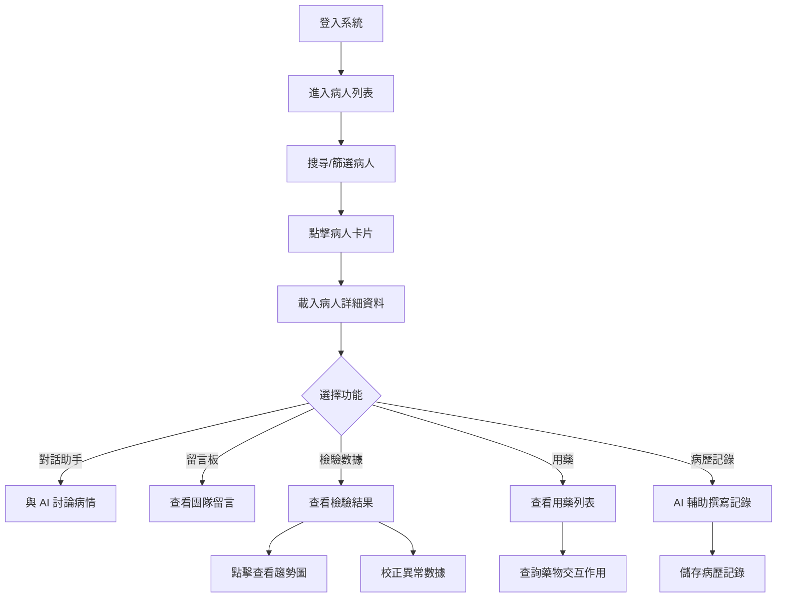
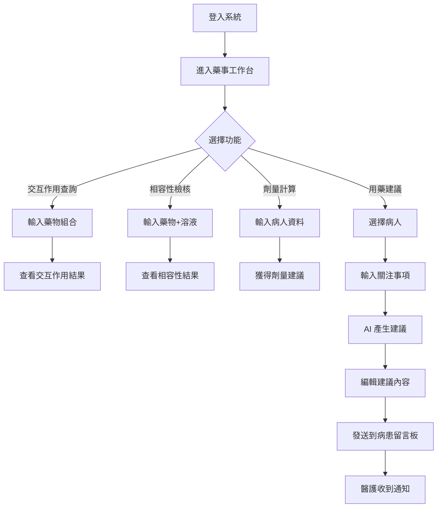
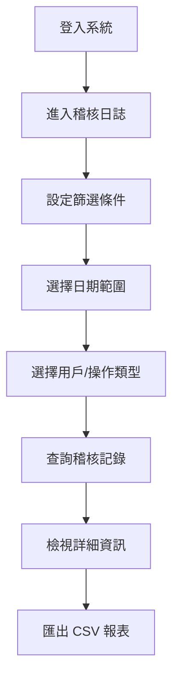

# ChatICU 系統架構總覽

## 文件說明
本文件提供 ChatICU 系統的完整架構視圖，包括系統流程圖、資料流向、組件依賴關係等。

---

## 目錄
1. [系統架構圖](#系統架構圖)
2. [前端架構](#前端架構)
3. [路由架構](#路由架構)
4. [組件樹狀圖](#組件樹狀圖)
5. [資料流向](#資料流向)
6. [關鍵業務流程](#關鍵業務流程)
7. [權限控制架構](#權限控制架構)
8. [檔案結構](#檔案結構)

---

## 系統架構圖

```
┌─────────────────────────────────────────────────────────────┐
│                         使用者端                              │
│  ┌──────────┐  ┌──────────┐  ┌──────────┐  ┌──────────┐   │
│  │  護理師  │  │  醫師    │  │  藥師    │  │  管理者  │   │
│  └──────────┘  └──────────┘  └──────────┘  └──────────┘   │
│       │              │              │              │         │
└───────┼──────────────┼──────────────┼──────────────┼─────────┘
        │              │              │              │
        └──────────────┴──────────────┴──────────────┘
                            │
                            ▼
        ┌─────────────────────────────────────────┐
        │         React Frontend (Vite)            │
        │  ┌────────────────────────────────────┐ │
        │  │  React Router v6                   │ │
        │  │  - Public Routes                   │ │
        │  │  - Protected Routes                │ │
        │  │  - Admin Routes                    │ │
        │  │  - Pharmacy Routes                 │ │
        │  └────────────────────────────────────┘ │
        │  ┌────────────────────────────────────┐ │
        │  │  State Management                  │ │
        │  │  - Context API (Auth)              │ │
        │  │  - React Query (Server State)      │ │
        │  └────────────────────────────────────┘ │
        │  ┌────────────────────────────────────┐ │
        │  │  UI Components                     │ │
        │  │  - shadcn/ui                       │ │
        │  │  - Tailwind CSS v4                 │ │
        │  │  - Recharts                        │ │
        │  └────────────────────────────────────┘ │
        └─────────────────────────────────────────┘
                            │
                            │ HTTPS / WebSocket
                            ▼
        ┌─────────────────────────────────────────┐
        │         Backend API Server               │
        │  ┌────────────────────────────────────┐ │
        │  │  REST API (Express/NestJS)         │ │
        │  │  - Authentication (JWT)            │ │
        │  │  - Authorization (RBAC)            │ │
        │  │  - Rate Limiting                   │ │
        │  └────────────────────────────────────┘ │
        │  ┌────────────────────────────────────┐ │
        │  │  Business Logic Layer              │ │
        │  │  - Patient Management              │ │
        │  │  - Lab Data Processing             │ │
        │  │  - Medication Management           │ │
        │  │  - AI Integration                  │ │
        │  └────────────────────────────────────┘ │
        │  ┌────────────────────────────────────┐ │
        │  │  WebSocket Server                  │ │
        │  │  - Real-time Chat                  │ │
        │  │  - Notifications                   │ │
        │  └────────────────────────────────────┘ │
        └─────────────────────────────────────────┘
                            │
                ┌───────────┴───────────┐
                │                       │
                ▼                       ▼
    ┌────────────────────┐   ┌────────────────────┐
    │   PostgreSQL       │   │   Redis Cache      │
    │  - User Data       │   │  - Sessions        │
    │  - Patient Data    │   │  - Rate Limiting   │
    │  - Lab Data        │   │  - WebSocket       │
    │  - Medications     │   └────────────────────┘
    │  - Messages        │
    │  - Audit Logs      │
    └────────────────────┘
                            
                ▼                       ▼
    ┌────────────────────┐   ┌────────────────────┐
    │  Vector Database   │   │   AI Service       │
    │  (Pinecone/        │   │  (OpenAI/Azure     │
    │   Weaviate)        │   │   OpenAI)          │
    │  - Guidelines      │   │  - Chat Assistant  │
    │  - Drug Info       │   │  - Text Polishing  │
    │  - Literature      │   │  - RAG             │
    └────────────────────┘   └────────────────────┘
```

---

## 前端架構

### 技術棧
```
React 18.3.1 + TypeScript
├── 路由管理: React Router v6
├── 狀態管理: Context API + React Query (建議)
├── UI 框架: Tailwind CSS v4 + shadcn/ui
├── 圖表: Recharts
├── HTTP 客戶端: Axios (待實作)
├── WebSocket: Socket.io-client (待實作)
├── Toast: Sonner
└── 表單處理: react-hook-form (部分使用)
```

### 層級架構
```
App
├── AuthProvider (認證上下文)
│   └── BrowserRouter (路由)
│       ├── Public Routes (登入頁)
│       └── Protected Routes
│           ├── AppLayout (側邊欄 + 內容區)
│           │   ├── SidebarProvider
│           │   ├── AppSidebar
│           │   ├── SidebarToggle
│           │   └── Main Content (各頁面)
│           │
│           ├── General Routes (醫護)
│           │   ├── Dashboard
│           │   ├── Patients
│           │   ├── PatientDetail
│           │   └── Chat
│           │
│           ├── Pharmacy Routes (藥師)
│           │   ├── Workstation
│           │   ├── Interactions
│           │   ├── Compatibility
│           │   ├── Dosage
│           │   └── Statistics
│           │
│           └── Admin Routes (管理者)
│               ├── Audit
│               ├── Vectors
│               └── Users
│
└── Toaster (全域 Toast 通知)
```

---

## 路由架構

### 路由樹狀圖
```
/
├── /login (公開)
│
├── /dashboard (全部角色)
│
├── /patients (醫護)
│   └── /patient/:id (醫護)
│       ├── ?tab=chat (對話助手)
│       ├── ?tab=messages (留言板 - 全部角色可見)
│       ├── ?tab=records (病歷記錄)
│       ├── ?tab=labs (檢驗數據)
│       ├── ?tab=meds (用藥)
│       └── ?tab=summary (病歷摘要)
│
├── /chat (全部角色)
│
├── /pharmacy (藥師 + 管理者)
│   ├── /pharmacy/workstation
│   ├── /pharmacy/interactions
│   ├── /pharmacy/compatibility
│   ├── /pharmacy/dosage
│   ├── /pharmacy/error-report
│   └── /pharmacy/advice-statistics
│
└── /admin (僅管理者)
    ├── /admin/audit
    ├── /admin/vectors
    └── /admin/users
```

### 權限保護
```typescript
// Route Guards
ProtectedRoute: 需要登入
AdminRoute: 需要 admin 角色
PharmacyRoute: 需要 pharmacist 或 admin 角色

// Component Level
{user?.role === 'admin' && <AdminButton />}
{(user?.role === 'doctor' || user?.role === 'admin') && <ProgressNote />}
{(user?.role === 'pharmacist' || user?.role === 'admin') && <PharmacyWidget />}
```

---

## 組件樹狀圖

### 病人詳細頁面組件樹
```
PatientDetailPage
├── 頁首資訊條
│   ├── Button (返回)
│   ├── 病人基本資訊
│   │   ├── 床號徽章
│   │   ├── 姓名
│   │   ├── 插管標記
│   │   └── 住院天數
│   └── Button (編輯) - 僅 admin
│
├── Tabs (分頁)
│   ├── TabsList (分頁列表)
│   │   ├── Tab: 對話助手
│   │   ├── Tab: 留言板 (含未讀徽章)
│   │   ├── Tab: 病歷記錄
│   │   ├── Tab: 檢驗數據
│   │   ├── Tab: 用藥
│   │   └── Tab: 病歷摘要
│   │
│   ├── TabContent: 對話助手
│   │   ├── 左側: 對話記錄列表
│   │   │   ├── Button (新對話)
│   │   │   └── ScrollArea (對話列表)
│   │   │       └── ChatSessionCard[] (對話卡片)
│   │   │
│   │   └── 右側: 對話區
│   │       ├── CardHeader
│   │       │   ├── 標題
│   │       │   ├── Button (更新患者數值)
│   │       │   └── Button (隱藏/顯示記錄)
│   │       ├── CardContent
│   │       │   ├── 對話訊息列表
│   │       │   │   └── ChatMessage[]
│   │       │   │       ├── 訊息氣泡
│   │       │   │       ├── 參考依據 (可展開/收起)
│   │       │   │       └── Button (複製)
│   │       │   │
│   │       │   └── 輸入區
│   │       │       ├── Textarea (訊息輸入)
│   │       │       └── Button (發送)
│   │       │
│   │       └── ProgressNoteWidget (僅醫師/管理者)
│   │           ├── Textarea (草稿輸入)
│   │           ├── Button (AI 修飾)
│   │           ├── 修飾結果
│   │           └── Button (複製/匯入)
│   │
│   ├── TabContent: 留言板
│   │   ├── CardHeader
│   │   │   ├── 標題 + 未讀徽章
│   │   │   └── Button (全部標為已讀)
│   │   ├── 新增留言區
│   │   │   ├── Textarea (留言輸入)
│   │   │   ├── Button (發送留言)
│   │   │   └── Button (標記為用藥建議)
│   │   └── 留言列表
│   │       └── MessageCard[]
│   │           ├── 作者資訊 (含角色圖示)
│   │           ├── 留言內容
│   │           ├── 類型徽章
│   │           └── Button (標為已讀)
│   │
│   ├── TabContent: 病歷記錄
│   │   └── MedicalRecords Component
│   │       ├── 記錄類型選擇
│   │       │   ├── Button (進展記錄) - 醫師
│   │       │   ├── Button (護理記錄)
│   │       │   └── Button (會診記錄) - 醫師
│   │       ├── 輸入區
│   │       │   ├── Textarea (記錄內容)
│   │       │   ├── Button (AI 輔助修飾)
│   │       │   └── Button (儲存記錄)
│   │       └── 歷史記錄列表
│   │           └── RecordCard[]
│   │
│   ├── TabContent: 檢驗數據
│   │   ├── 生命徵象區
│   │   │   └── VitalSignCard[]
│   │   │       ├── 數值顯示
│   │   │       ├── 異常標記
│   │   │       └── onClick → 開啟趨勢圖
│   │   │
│   │   └── 檢驗數據區
│   │       └── LabDataDisplay Component
│   │           ├── Tabs (生化/血液/凝血/血氣/發炎)
│   │           ├── Table (檢驗項目表格)
│   │           │   ├── 項目名稱
│   │           │   ├── 數值 + 單位
│   │           │   ├── 參考範圍
│   │           │   ├── 異常標記 (↑↓)
│   │           │   ├── Button (校正)
│   │           │   └── Button (查看趨勢)
│   │           │
│   │           ├── LabTrendChart (趨勢圖對話框)
│   │           │   ├── 折線圖 (Recharts)
│   │           │   ├── 當前數值
│   │           │   ├── 變化量/變化率
│   │           │   └── 參考範圍
│   │           │
│   │           └── CorrectionDialog (校正對話框)
│   │               ├── Input (新數值)
│   │               ├── Textarea (校正理由)
│   │               └── Button (確認校正)
│   │
│   ├── TabContent: 用藥
│   │   ├── S/A/N 藥物卡片
│   │   │   ├── Pain Card
│   │   │   ├── Sedation Card
│   │   │   └── NMB Card
│   │   ├── 其他藥物列表
│   │   │   └── MedicationCard[]
│   │   ├── 操作按鈕
│   │   │   ├── Button (交互作用查詢)
│   │   │   └── Button (複製到報告)
│   │   │
│   │   └── PharmacistAdviceWidget (僅藥師/管理者)
│   │       ├── Select (關注類型)
│   │       ├── Textarea (關注細節)
│   │       ├── Button (AI 產生建議)
│   │       ├── 修飾後建議
│   │       ├── Button (複製)
│   │       └── Button (發送到病患留言)
│   │
│   └── TabContent: 病歷摘要
│       ├── 基本資訊 Card
│       ├── 症狀 Card
│       ├── 入院診斷 Card
│       └── 風險與警示 Card
│
└── Dialog: 生命徵象趨勢圖
    └── LabTrendChart Component
```

---

## 資料流向

### 1. 認證流程
```
User Input (帳號密碼)
    ↓
AuthContext.login()
    ↓
POST /auth/login
    ↓
Backend 驗證
    ↓
回傳 { token, user }
    ↓
儲存到 localStorage
    ↓
更新 AuthContext.user
    ↓
導航至 /dashboard
```

### 2. 查看病人詳細資料流程
```
點擊病人卡片
    ↓
導航至 /patient/:id
    ↓
並行 API 請求:
    ├── GET /patients/:id (病人基本資料)
    ├── GET /patients/:id/lab-data/latest (最新檢驗數據)
    ├── GET /patients/:id/vital-signs/latest (最新生命徵象)
    ├── GET /patients/:id/medications (用藥列表)
    ├── GET /patients/:id/messages (留言板)
    └── GET /patients/:id/chat-sessions (對話記錄)
    ↓
更新頁面狀態
    ↓
渲染病人詳細頁面
```

### 3. AI 對話流程
```
用戶輸入訊息
    ↓
更新 chatMessages (user message)
    ↓
POST /ai/chat {
    patientId,
    message,
    context: {
        includeLabData: true,
        includeMedications: true
    }
}
    ↓
Backend 處理:
    ├── 取得病人最新資料
    ├── 查詢向量資料庫 (RAG)
    ├── 呼叫 OpenAI API
    └── 回傳 AI 回應 + 參考依據
    ↓
更新 chatMessages (assistant message)
    ↓
自動儲存對話記錄
    ↓
更新 chatSessions 狀態
```

### 4. 檢驗數據校正流程
```
點擊「校正」按鈕
    ↓
開啟校正對話框
    ↓
輸入新數值 + 校正理由
    ↓
PATCH /patients/:id/lab-data/:labDataId/correct {
    labName,
    oldValue,
    newValue,
    reason
}
    ↓
Backend:
    ├── 更新檢驗數據
    ├── 記錄稽核日誌
    └── 回傳成功
    ↓
重新取得最新檢驗數據
    ↓
更新頁面顯示
    ↓
顯示成功 Toast
```

### 5. 藥師發送用藥建議流程
```
藥師輸入關注細節
    ↓
POST /pharmacy/advice/generate {
    patientId,
    concernType,
    concernDetails
}
    ↓
Backend AI 產生建議
    ↓
顯示修飾後建議 (可編輯)
    ↓
藥師確認並點擊「發送到病患留言」
    ↓
POST /pharmacy/advice/:adviceId/send-to-patient {
    patientId,
    adviceContent
}
    ↓
Backend:
    ├── 創建留言記錄 (messageType: medication-advice)
    ├── 觸發 WebSocket 通知
    └── 回傳成功
    ↓
醫護在留言板收到新留言通知
```

### 6. 即時聊天室流程
```
用戶進入聊天室頁面
    ↓
GET /chat/messages (載入歷史訊息)
    ↓
建立 WebSocket 連線
ws://api.chaticu.hospital/v1/ws/chat?token={jwt}
    ↓
用戶發送訊息
    ↓
POST /chat/messages { content }
    ↓
Backend:
    ├── 儲存訊息到資料庫
    └── WebSocket 廣播給所有線上用戶
    ↓
其他用戶收到 WebSocket 訊息
    ↓
更新聊天室訊息列表
```

---

## 關鍵業務流程

### 醫護查看病人流程


### 藥師提供用藥建議流程


### 管理者稽核流程


---

## 權限控制架構

### RBAC (Role-Based Access Control)

#### 四種角色權限矩陣
```
功能 / 角色                Nurse  Doctor  Admin  Pharmacist
===============================================================
病人管理
  - 查看病人列表              ✓      ✓      ✓        ✗
  - 查看病人詳情              ✓      ✓      ✓        ✗
  - 編輯病人基本資料           ✗      ✗      ✓        ✗

檢驗數據
  - 查看檢驗數據              ✓      ✓      ✓        ✗
  - 校正檢驗數據              ✓      ✓      ✓        ✗
  - 上傳檢驗數據 (OCR)        ✗      ✗      ✓        ✗

AI 功能
  - AI 對話助手               ✓      ✓      ✓        ✗
  - Progress Note 輔助        ✗      ✓      ✓        ✗
  - 護理記錄輔助              ✓      ✓      ✓        ✗

留言板
  - 查看留言                  ✓      ✓      ✓        ✓
  - 發送留言                  ✓      ✓      ✓        ✓
  - 發送用藥建議              ✗      ✗      ✓        ✓

藥事支援
  - 藥物交互作用查詢           ✗      ✗      ✓        ✓
  - 相容性檢核                ✗      ✗      ✓        ✓
  - 劑量計算                  ✗      ✗      ✓        ✓
  - 用藥建議產生              ✗      ✗      ✓        ✓

管理功能
  - 稽核日誌                  ✗      ✗      ✓        ✗
  - 向量資料庫管理            ✗      ✗      ✓        ✗
  - 用戶管理                  ✗      ✗      ✓        ✗

團隊協作
  - 團隊聊天室                ✓      ✓      ✓        ✓
```

### 權限檢查實作層級

#### 1. 路由層級
```typescript
// /App.tsx
<Route
  path="/admin/users"
  element={
    <AdminRoute>
      <UsersPage />
    </AdminRoute>
  }
/>
```

#### 2. 組件層級
```typescript
// /pages/patient-detail.tsx
{(user?.role === 'doctor' || user?.role === 'admin') && (
  <ProgressNoteWidget />
)}
```

#### 3. API 層級 (後端)
```typescript
// Backend middleware
const requireAdmin = (req, res, next) => {
  if (req.user.role !== 'admin') {
    return res.status(403).json({ error: 'Forbidden' });
  }
  next();
};

router.post('/admin/users', requireAdmin, createUser);
```

---

## 檔案結構

```
/
├── public/
│   └── (靜態資源)
│
├── src/
│   ├── components/
│   │   ├── ui/ (shadcn/ui 組件)
│   │   │   ├── button.tsx
│   │   │   ├── card.tsx
│   │   │   ├── input.tsx
│   │   │   ├── tabs.tsx
│   │   │   └── ... (其他 UI 組件)
│   │   │
│   │   ├── figma/ (Figma 匯入組件)
│   │   │   └── ImageWithFallback.tsx
│   │   │
│   │   ├── app-sidebar.tsx (側邊欄)
│   │   ├── sidebar-toggle.tsx (側邊欄開關)
│   │   ├── lab-data-display.tsx (檢驗數據顯示)
│   │   ├── lab-trend-chart.tsx (檢驗趨勢圖)
│   │   ├── medical-records.tsx (病歷記錄)
│   │   ├── pharmacist-advice-widget.tsx (藥師建議)
│   │   └── vital-signs-card.tsx (生命徵象卡片)
│   │
│   ├── pages/
│   │   ├── login.tsx (登入頁)
│   │   ├── dashboard.tsx (儀表板)
│   │   ├── patients.tsx (病人列表)
│   │   ├── patient-detail.tsx (病人詳細頁)
│   │   ├── chat.tsx (團隊聊天室)
│   │   │
│   │   ├── pharmacy/ (藥師專屬頁面)
│   │   │   ├── workstation.tsx
│   │   │   ├── interactions.tsx
│   │   │   ├── compatibility.tsx
│   │   │   ├── dosage.tsx
│   │   │   ├── error-report.tsx
│   │   │   └── advice-statistics.tsx
│   │   │
│   │   └── admin/ (管理者專屬頁面)
│   │       ├── placeholder.tsx (稽核日誌)
│   │       ├── vectors.tsx
│   │       └── users.tsx
│   │
│   ├── lib/
│   │   ├── auth-context.tsx (認證上下文)
│   │   ├── clipboard-utils.ts (剪貼簿工具)
│   │   ├── mock-data.ts (模擬資料)
│   │   └── api-client.ts (待實作 - Axios 設定)
│   │
│   ├── styles/
│   │   └── globals.css (全域樣式)
│   │
│   ├── App.tsx (根組件)
│   └── main.tsx (入口文件)
│
├── API_SPECIFICATION.md (API 規格文件)
├── FRONTEND_INTERACTION_MAP.md (前端互動對照表)
├── SYSTEM_ARCHITECTURE.md (本文件)
├── README.md
└── package.json
```

---

## 關鍵資料結構

### User (用戶)
```typescript
interface User {
  id: string;
  name: string;
  email: string;
  role: 'nurse' | 'doctor' | 'admin' | 'pharmacist';
  unit: string;
  active: boolean;
  lastLogin: string;
  createdAt: string;
}
```

### Patient (病人)
```typescript
interface Patient {
  id: string;
  name: string;
  age: number;
  gender: 'male' | 'female';
  bedNumber: string;
  admissionDate: string;
  icuAdmissionDate: string;
  diagnosis: string;
  intubated: boolean;
  criticalStatus: string;
  alerts: string[];
  unreadMessages: number;
}
```

### LabData (檢驗數據)
```typescript
interface LabData {
  patientId: string;
  timestamp: string;
  biochemistry: Record<string, LabValue>;
  hematology: Record<string, LabValue>;
  bloodGas: Record<string, LabValue>;
  inflammatory: Record<string, LabValue>;
}

interface LabValue {
  value: number;
  unit: string;
  referenceRange: string;
  isAbnormal: boolean;
}
```

### ChatMessage (對話訊息)
```typescript
interface ChatMessage {
  id: string;
  role: 'user' | 'assistant';
  content: string;
  references?: string[]; // AI 回應的參考依據
  timestamp: string;
}

interface ChatSession {
  id: string;
  patientId: string;
  title: string;
  sessionDate: string;
  sessionTime: string;
  lastUpdated: string;
  messages: ChatMessage[];
  labDataSnapshot?: Record<string, number>;
}
```

---

## 技術決策紀錄

### 1. 為何選擇 Context API 而非 Redux?
- 系統規模中等，不需要複雜的狀態管理
- 僅需管理用戶認證狀態
- 伺服器狀態建議使用 React Query 管理
- 減少學習成本和 boilerplate

### 2. 為何使用 Tailwind CSS v4?
- 極簡化配色要求（5 種核心顏色）
- 快速開發，無需撰寫 CSS 檔案
- shadcn/ui 完美支援
- v4 的 CSS 變數系統更靈活

### 3. 為何選擇 Recharts?
- 與 React 整合度高
- 支援響應式設計
- 豐富的圖表類型（折線圖、圓餅圖）
- 文件完整

### 4. 檢驗數據校正為何需要填寫理由?
- 稽核需求：所有資料變更必須可追蹤
- HIPAA 合規：醫療資料變更需記錄
- 責任歸屬：明確誰在何時因何原因修改數據

### 5. 為何 AI 回應需要顯示參考依據?
- 臨床決策輔助透明度
- 讓醫護人員可以查證資訊來源
- 建立對 AI 系統的信任
- 符合醫療法規要求（可追溯性）

---

## 效能優化建議

### 1. 前端優化
```typescript
// 使用 React.memo 避免不必要的重渲染
const VitalSignCard = React.memo(({ label, value, unit }) => {
  // ...
});

// 使用 useMemo 快取計算結果
const abnormalLabs = useMemo(() => {
  return labs.filter(lab => lab.isAbnormal);
}, [labs]);

// 使用 useCallback 避免函式重新創建
const handleClick = useCallback(() => {
  fetchLabData(patientId);
}, [patientId]);
```

### 2. 資料載入優化
```typescript
// 並行載入資料
useEffect(() => {
  Promise.all([
    fetchPatientDetail(id),
    fetchLabData(id),
    fetchMedications(id)
  ]).then(([patient, labs, meds]) => {
    setPatient(patient);
    setLabs(labs);
    setMedications(meds);
  });
}, [id]);

// 使用 React Query 的快取機制
const { data: patient } = useQuery(
  ['patient', id],
  () => fetchPatient(id),
  { staleTime: 5 * 60 * 1000 } // 5 分鐘內使用快取
);
```

### 3. 搜尋防抖
```typescript
// 搜尋框使用 debounce
const debouncedSearch = useMemo(
  () => debounce((term) => {
    fetchPatients({ search: term });
  }, 500),
  []
);
```

### 4. 虛擬滾動
```typescript
// 長列表使用虛擬滾動 (react-window)
import { FixedSizeList } from 'react-window';

<FixedSizeList
  height={600}
  itemCount={patients.length}
  itemSize={100}
>
  {({ index, style }) => (
    <PatientCard style={style} patient={patients[index]} />
  )}
</FixedSizeList>
```

---

## 安全性考量

### 1. 認證機制
- JWT Token 儲存於 localStorage
- Access Token 有效期：24 小時
- Refresh Token 有效期：7 天
- 自動刷新 Token 機制

### 2. API 安全
- 所有 API 請求需帶 Authorization header
- HTTPS 加密傳輸
- CORS 設定限制來源
- Rate Limiting 防止濫用

### 3. XSS 防護
- React 自動 escape 輸出
- 不使用 dangerouslySetInnerHTML
- CSP (Content Security Policy) 設定

### 4. CSRF 防護
- SameSite Cookie 設定
- CSRF Token 驗證

### 5. 資料保護
- 病人資料加密存儲
- 敏感資料不顯示於 URL
- 稽核日誌記錄所有操作

---

## 未來擴充規劃

### 短期 (1-3 個月)
1. 實作 React Query 取代 useState 管理伺服器狀態
2. WebSocket 即時通知系統
3. 行動版響應式優化
4. 單元測試 (Jest + React Testing Library)
5. E2E 測試 (Playwright)

### 中期 (3-6 個月)
1. PWA 支援（離線模式）
2. 多語言支援 (i18n)
3. 深色模式
4. 進階報表功能
5. 資料匯出 (Excel/PDF)

### 長期 (6-12 個月)
1. 行動 App (React Native)
2. 語音輸入功能
3. 影像 AI 分析 (X-ray/CT 判讀輔助)
4. 預測性警示系統
5. 與 HIS/EMR 系統整合

---

## 交接檢查清單

### 前端交付項目
- [x] 完整原始碼
- [x] API 規格文件
- [x] 前端互動對照表
- [x] 系統架構文件
- [ ] 環境變數設定說明
- [ ] 部署指南
- [ ] 測試帳號清單

### 後端需求項目
- [ ] 實作所有 API 端點
- [ ] 資料庫 Schema 設計
- [ ] JWT 認證系統
- [ ] RBAC 權限控制
- [ ] 向量資料庫設定
- [ ] OpenAI API 整合
- [ ] WebSocket 伺服器
- [ ] 稽核日誌系統
- [ ] OCR 服務
- [ ] 部署環境設定

### 測試項目
- [ ] 單元測試
- [ ] 整合測試
- [ ] E2E 測試
- [ ] 效能測試
- [ ] 安全性測試
- [ ] 使用者驗收測試 (UAT)

---

**文件結束**

更新日期: 2026-01-10
版本: 1.0.0
